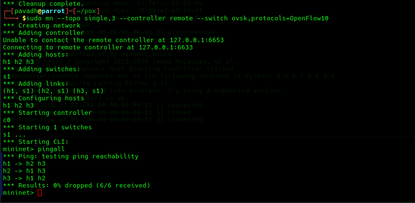
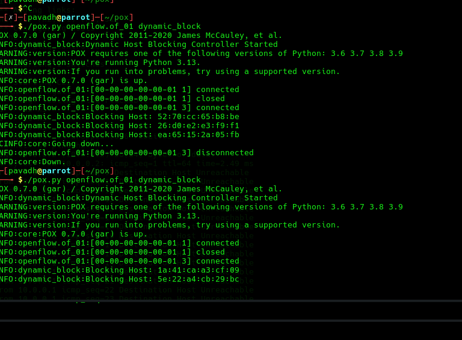
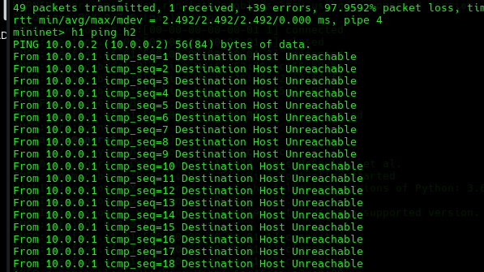
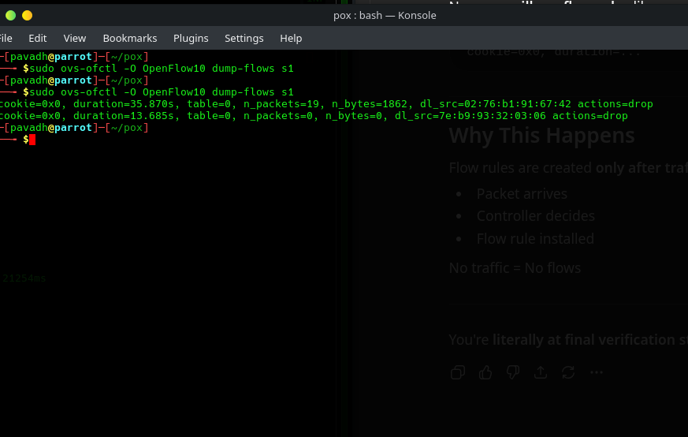
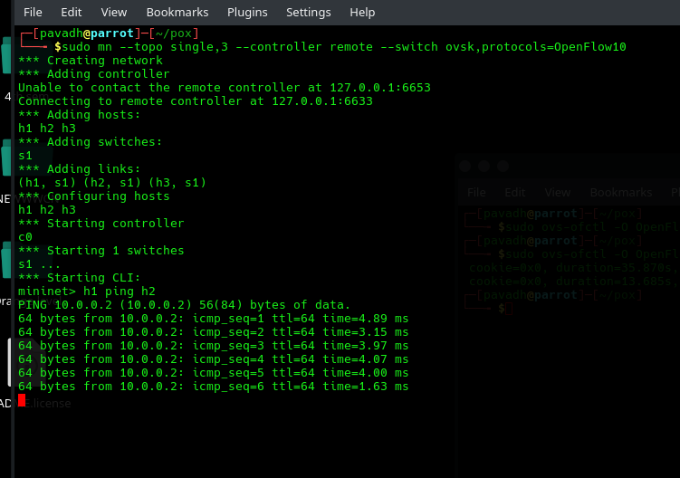
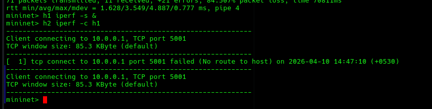

# Dynamic Host Blocking System using SDN

## Problem Statement
This project implements a Dynamic Host Blocking System using Software Defined Networking. The system detects suspicious traffic and blocks malicious hosts using OpenFlow rules.

## Setup Steps

Start Controller:
cd ~/pox
./pox.py openflow.of_01 dynamic_block

Start Mininet:
sudo mn --topo single,3 --controller remote --switch ovsk,protocols=OpenFlow10

## Test Scenarios

### Normal Traffic Allowed
All hosts communicate successfully.

### Host Blocking Detected
Controller detects suspicious host.

### Blocked Host Verification
Communication fails after blocking.

## Flow Table Rules

## Performance

### Latency

### Throughput

## Expected Output

- Normal traffic: All hosts communicate
- Suspicious traffic: Host gets blocked
- After blocking: Communication fails
- Flow table: Drop rule visible

## References

- Mininet Documentation
- POX Controller Documentation
- OpenFlow Documentation
